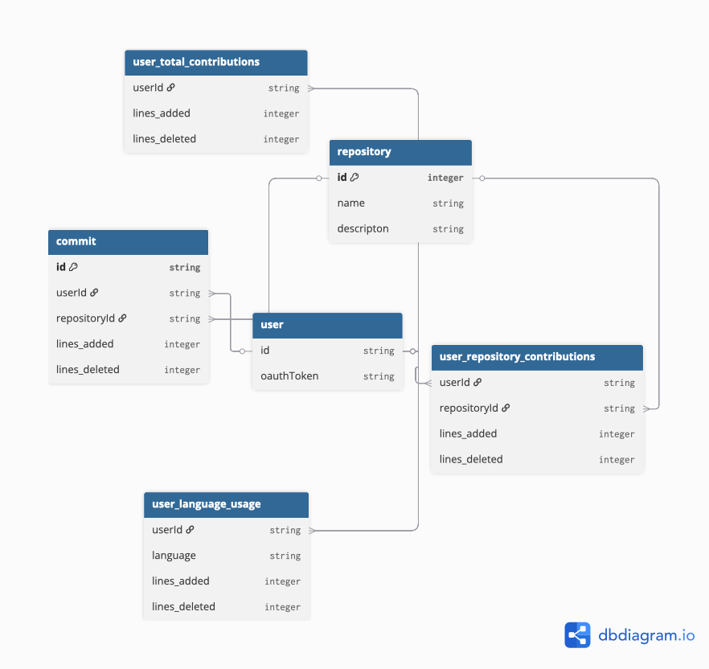

---

title: "Introduction to GitRipper"
description: "Learn the basics of GitRipper in the Dijkstra Backend."
---------------------------------------------------------------------

**GitRipper** is a backend service that synchronises and aggregates GitHub commit statistics for users of the Dijkstra platform. It combines real‑time webhook ingestion with scheduled bulk synchronisation to ensure a complete and reliable view of a student’s contribution history.

As a core component of the Dijkstra ecosystem, GitRipper powers two key capabilities:

* **Student progress tracking** – giving learners clear, quantitative feedback on their open‑source engagement.
* **Employer visibility** – enabling recruiters to evaluate a student’s contribution footprint across repositories, organisations, and projects.

The primary objective of GitRipper is to aggregate and enrich contribution metrics such as:

* Repositories contributed to
* Reputation and relevance of those repositories
* Frequency, recency, and volume of contributions

Future iterations will apply NLP and static analysis techniques to assess the *technical complexity* and *impact* of contributions, further improving the accuracy of the Helios student grading system.

---

## How Does It Work?

GitRipper operates through two complementary synchronisation flows that together guarantee completeness and low latency.

### 1. Bulk Synchronisation Flow (Cron + Temporal)

This flow is responsible for building and maintaining a complete historical view of a user’s GitHub activity.

**When it runs**

* Immediately after a user is onboarded on DataForge
* Periodically via a scheduled cron job

**How it works**

1. GitRipper fetches repository and commit data from GitHub using the **GraphQL API**.
2. A **Temporal workflow** orchestrates the synchronisation, enabling:

   * Fan‑out across multiple repositories
   * Parallel fetching of commit history
   * Fault‑tolerant retries and resumability
3. Normalised commit and repository metadata is persisted into PostgreSQL for downstream analytics and scoring.

This ensures that even if webhook delivery fails or a repository is added later, the system eventually converges to a correct and complete state.

---

### 2. Asynchronous Sync Flow (Webhooks + Kafka)

This flow provides near real‑time updates as students push new commits.

**How it works**

1. Dijkstra configures a **GitHub App** that users install during onboarding.
2. The GitHub App emits webhook events (e.g. `push`, `commit_comment`, `repository`) for all repositories in scope.
3. Webhook events are delivered to Kafka and consumed by GitRipper.
4. GitRipper processes the events and updates the relevant commit and repository records in PostgreSQL.

This guarantees that contribution metrics stay fresh without waiting for the next bulk sync cycle.

---

## Conceptual Database Schema

At a high level, the schema models:

* **Users** and their linked GitHub identities
* **Repositories** and organisations
* **Commits** with author, timestamp, and metadata
* **Aggregations** used by Helios for scoring and ranking

---

## Tech Stack

* **Backend**: Spring Boot (Java)
* **Workflow Orchestration**: Temporal
* **Database**: PostgreSQL
* **Messaging**: Kafka
* **Source Integration**: GitHub GraphQL API & Webhooks
